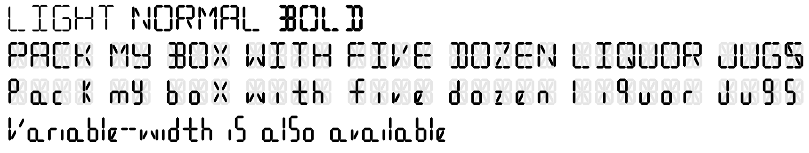

# Sixteen Font Family

Sixteen is a free font which imitates 16-segment LCD Displays. Its features include:

 - All standard ASCII chracters (except semicolon, which is an all-on character)
 - Light, regular, and bold weights
 - Monospace and variable-width versions
 - Available in TrueType (*.ttf, *.ttc), OpenType (*.otf), and Web Open Font Format (*.woff, *.woff2)
 - Licensed under the [SIL Open Font License 1.1](https://scripts.sil.org/cms/scripts/page.php?site_id=nrsi&id=OFL_web)

Check out the [demo website](https://stuffjackmakes.com/fsix/) for more information.

# Sample

  

# Usage

